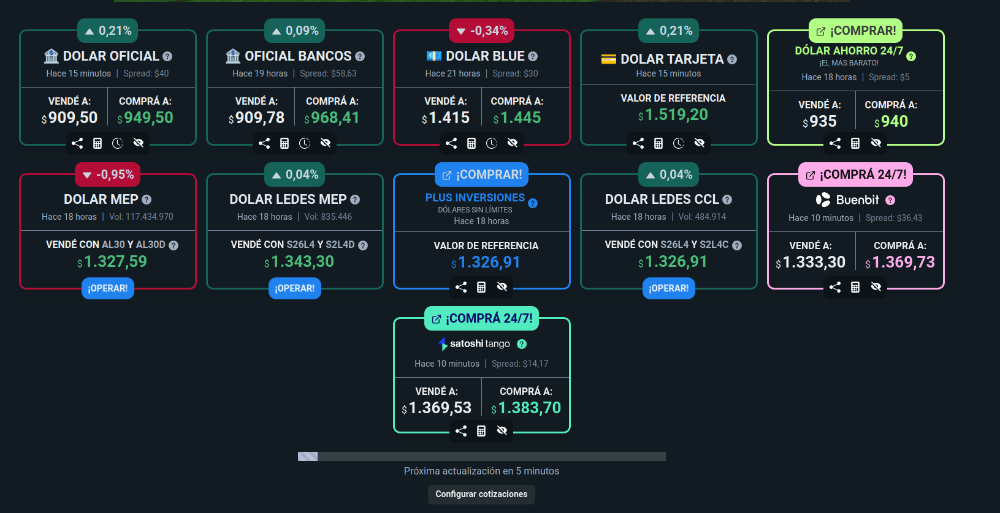
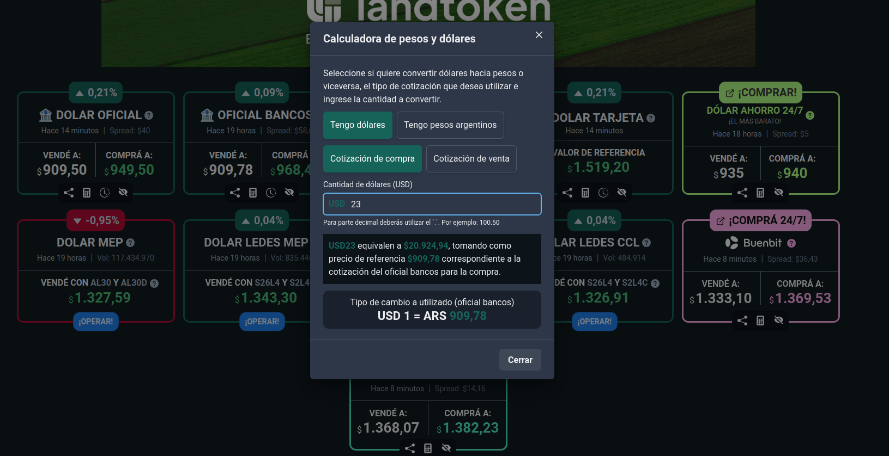
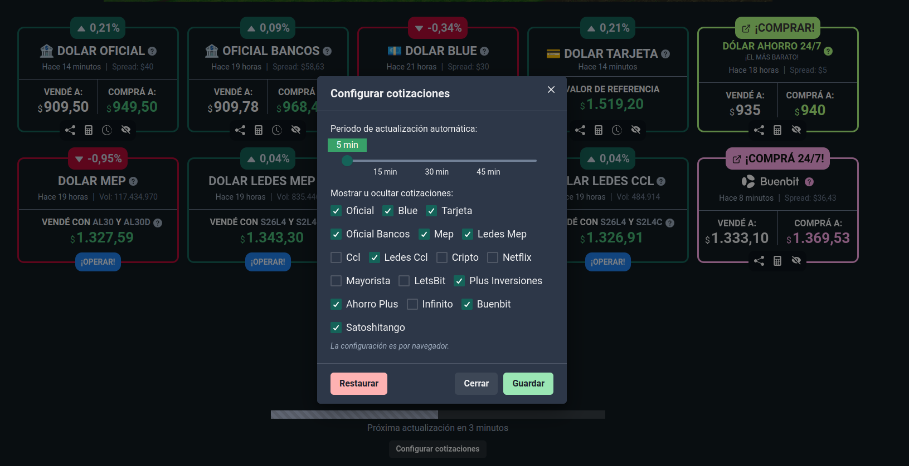
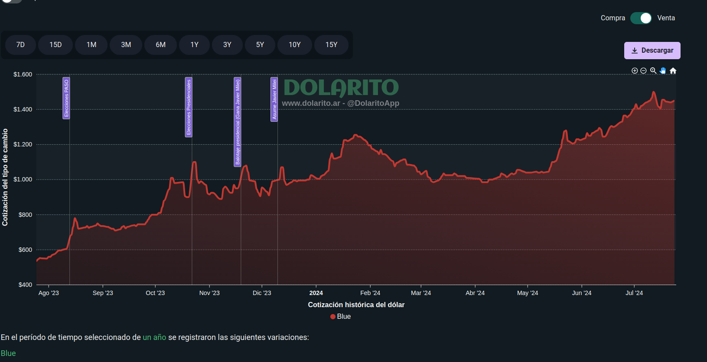

# Prueba tecnica para la empresa #MundoIt

Usando la api de [ArgentinaDatos](https://argentinadatos.com/docs/operations/get-cotizaciones-dolares.html)

## Historia del Requerimiento del Cliente

### Contexto

MundoIT ha sido contactado por una importante casa de cambio para desarrollar una aplicación web que permita a sus clientes visualizar y calcular el precio de compra y venta de dólares en diferentes casas de cambio. La aplicación debe ofrecer una manera intuitiva y gráfica para comparar los precios actuales y su evolución histórica, así como la posibilidad de gestionar la visibilidad de las casas de cambio.

### Requerimientos

El cliente necesita una solución que incluya las siguientes funcionalidades:

## Entrega 1

Crear una pantalla que muestre en tarjetas (cards) todas las casas de cambio que trae la API. Cada tarjeta debe mostrar el precio de la última fecha comparado con el día anterior en porcentaje.

Pantalla de cards de casas de cambio:

## Entrega 2

Crear una calculadora para todas las casas de cambio, la cual permita calcular el precio de compra y venta de dólares en base al precio de compra y venta de cada casa de cambio.

Calculadora de compra y venta de dólares:

## Entrega 3

Permitir al usuario eliminar/ver visualmente una casa de cambio de la lista de casas de cambio. Al refrescar la página, la casa de cambio eliminada no debe mostrarse.

Imagen de referencia de eliminación de casa de cambio:

## Entrega 4

Mostrar en un gráfico la evolución histórica del precio del dólar en cada casa de cambio.

Gráfico de evolución histórica:

## Información Adicional

- Puedes usar internet para buscar cualquier información que necesites.
- Puedes usar las librerías o frameworks que prefieras (preferentemente React).
- La prueba tiene una duración de 1 hora. No es necesario completar todas las entregas.
- Se proporcionará un proyecto configurado con ts, React, Vite y Tailwind, pero puedes optar por no usarlo si lo deseas.

Inspiración de diseño: [Dolarito](https://www.dolarito.ar/)
